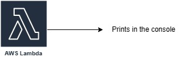
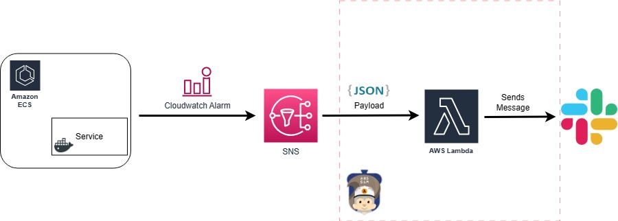

# AWS SAM

SAM CLI provides a Lambda-like execution environment that lets you locally build, test, and debug applications defined by SAM templates.<br>
[Clic here for more info](https://aws.amazon.com/serverless/sam/)

### Requisites

1. Install [AWS SAM](https://docs.aws.amazon.com/serverless-application-model/latest/developerguide/serverless-sam-cli-install.html)
2. Install [Docker](https://docs.docker.com/get-docker/)

### How to run

You can invoke a lambda locally using this command:
    `sam local invoke -e <pathToEvent/event.json> <functionName>`

1. To understand `functionName` see `template.yml`.

    How to define a lambda in `template.yml`: 
    - A lambda has to be defined with a function name
    - Its `Type` must be `AWS::Serverless::Function`
    - In `Properties`, CodeUri is the relative path to the Lambda function code file (i.e. `*.js`)
    - In `Properties`, Handler format is _fileName/handlerName_
    - You can define environment variables as you would do with a real lambda.

2. Events

As you know, Lambdas are powerful because they can be triggered by many others AWS Services.<br>
To simulate this in you localhost, we have the events file, which are basically json files.<br>
Events are located in `./events/`.

### Simple example



Just a _hello world_ function.

Run:

```sh
cd simple_example/
sam local invoke -e ./events/simple-event.json simpleLambda
```

### Complex example



when a ECS Service is using too much CPU or RAM, it will make an Alarm go into _ALARM STATE_ and that will trigger a SNS topic who will trigger a lambda function to send a Slack message to notify the development team.

We can simulate this situation by having the correct `json` event that is sent to the lambda and test that our code works correctly.

Run:
```sh
cd comples_example/
sam local invoke -e ./events/comples-event.json complexLambda
```

| Note: the lambda expects a value for `WEBHOOK_URL` env var. Define it yourself.