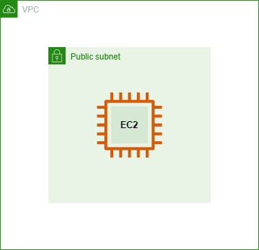
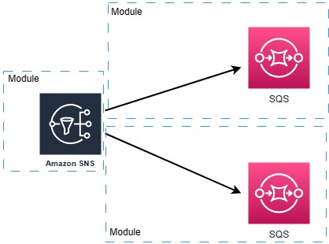

## Localstack

A fully functional local cloud stack.<br>
Develop and test your cloud and serverless
apps offline! <br>
[Clic here for more info](https://docs.localstack.cloud/getting-started/installation/#docker-compose)


### Requisites

1. You should have [docker](https://docs.docker.com/desktop/install/ubuntu/) installed.
2. You should have [terraform](https://developer.hashicorp.com/terraform/downloads) installed.

### How to run Simple example



In this example, the terraform code describes 1 VPC, 1 Subnet and 1 EC2 instance.

To run it, paste this in your terminal:

```sh
cd simple_example/
docker-compose up -d
terraform init
terraform apply -auto-approve
terraform show
```

### How to run Complex examaple



In the complex example, we are creating a SNS Topic, 2 SQS queues and subscribing those queues to the topic; all organized with terraform modules;

To test it:

```sh
cd complex_example/
docker-compose up -d
terraform init
terraform apply -auto-approve
terraform show
```

### Result

If you had no errors, you should have a stable `terraform.state` file. Notice how the ARNs show something similar to:

```
arn:aws:ec2:region-1:000000000000:vpc/vpc-xxxxxx
```

That means that localstack is faking the resources correctly. And that is thanks to:

```tf
  endpoints {
    ec2 = "http://localhost:4566"
  }
```

Now you can just safely delete the state file and kill the container.

```sh
terraform destroy -auto-approve
docker-compose down
```
